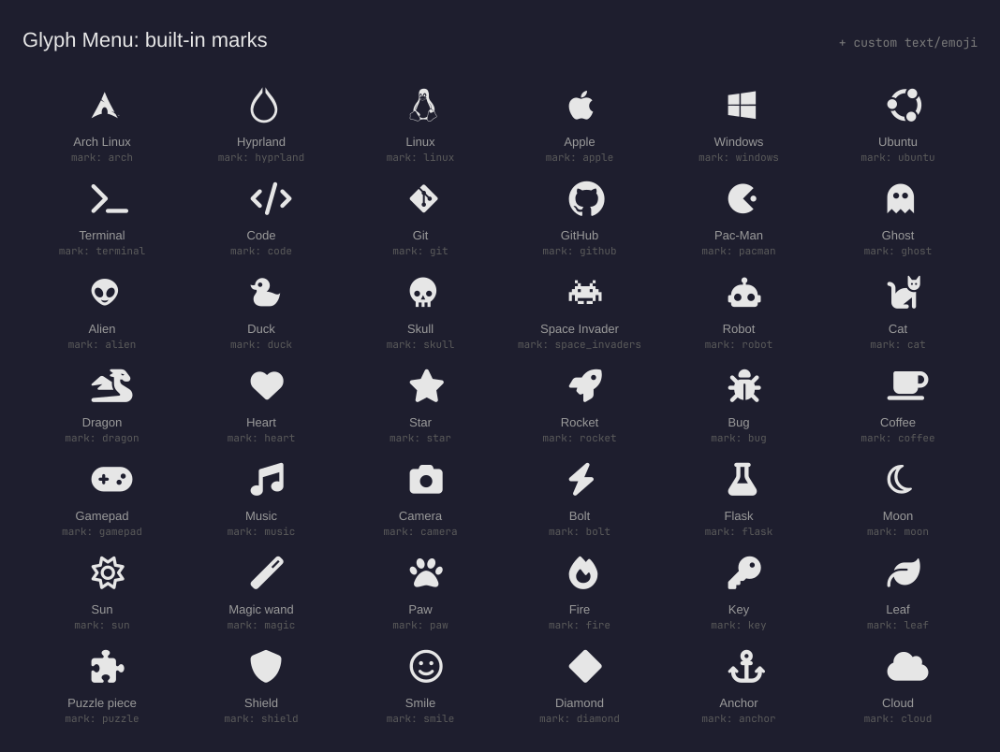
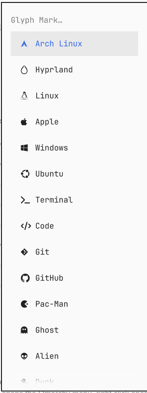

# Glyph Menu

A drop-in replacement for the built-in `omarchy.menu` bar button that lets you
pick the mark it shows instead of the fixed Omarchy glyph. Click behaviour is
unchanged: left click opens the Omarchy menu, right click opens a terminal.

Choose from 141+ built-in glyphs, mostly Nerd Font icons (distro logos,
coding tools, gaming icons, animals, a Pac-Man, a ghost, a dragon, and more),
plus Omarchy's own mark, or set any custom text, pasted glyph, or emoji.

No runtime dependencies beyond Omarchy itself and a Nerd Font (already part
of a standard Omarchy install): no network access, no install hooks, no sudo.
The dev tooling under `tools/` (for regenerating the catalog) additionally
needs Node.js and `rsvg-convert` (from `librsvg`), neither of which is needed
to install or use the plugin.

## Available marks



Rendered as an image (not raw glyph characters) so it displays correctly here
on GitHub even without a Nerd Font installed. The `mark:` value printed under
each icon is what you pass to `omarchy bar set` (see [Settings](#settings)) or
select from the [menu picker](#optional-a-real-menu-picker). To list them from
a checkout instead of reading the image:

```sh
node -e 'require("./Glyphs.js").glyphs().forEach(g => console.log(g.id))'
```

## Install

```sh
omarchy plugin add https://github.com/SmoothPixels/glyph-menu.git --enable
```

Then drop `omarchy.menu`'s own button from the bar, but **do not**
`omarchy plugin disable omarchy.menu`. That plugin provides both the button
(`bar-widget` kind) and the menu popup itself (`menu` kind); disabling it
turns off both, and this plugin's click handler opens the popup by calling
back into that same `menu` kind. Instead, leave it enabled and just remove
its layout entry so only its popup (loaded on demand, independent of the bar
layout) survives:

```sh
jq -c '(.bar.layout.left, .bar.layout.center, .bar.layout.right) |=
  map(select(.id != "omarchy.menu"))' ~/.config/omarchy/shell.json \
  > /tmp/shell.json.new && mv /tmp/shell.json.new ~/.config/omarchy/shell.json
omarchy-shell shell rescanPlugins
```

## Settings

There's no graphical settings form for bar widgets in Omarchy yet (this ships
its manifest schema for whenever one exists, no changes will be needed then),
so configure from the CLI:

```sh
omarchy bar set io.github.smoothpixels.glyph-menu mark pacman
```

| Key | Effect |
| --- | --- |
| `mark` | The glyph. Set to `custom` to use `customText` instead. |
| `customText` | Any text or character: a pasted glyph, an emoji, a word. |
| `customFont` | Font family for the custom mark. Empty falls back to `nerdFont`. |
| `nerdFont` | Font family the built-in Nerd Font marks are drawn in. Empty follows the bar's own font. Ignored by the Omarchy mark, which always uses Omarchy's own font so it renders correctly. |
| `fontSize` | Pixel size. `0` follows the bar. |
| `color` | Empty follows the active theme. `accent`, or a `#rrggbb` hex value. |

Marks are single-colour text glyphs, so they follow the theme (or a fixed
color/accent you choose): there's no multicolour distro logo option, the same
tradeoff every Nerd Font icon in the bar already makes.

If a change doesn't seem to take (rare, seen after `omarchy plugin update`
specifically), check `~/.config/omarchy/shell.json` first. If it already shows
the new value but the bar hasn't caught up, run `omarchy-restart-shell` rather
than repeating the `bar set` command.

### Optional: a real menu picker

`omarchy bar set` is a command, not a picker. If you'd rather click through a
menu, this ships a ready-made "Style → Menu Bar → Glyph Mark" submenu: one
row per glyph, using the Omarchy menu's own icon column (so it
genuinely shows icons, unlike a settings-form dropdown):



It's opt-in, and nothing in this plugin writes to your menu config: you add
it yourself. Open (or create) `~/.config/omarchy/extensions/omarchy-menu.jsonc`
and paste every `"style.bar.glyph…"` line from
`~/.config/omarchy/plugins/io.github.smoothpixels.glyph-menu/extensions/omarchy-menu.snippet.jsonc`
right after its opening `{` (each line ends in a comma, so they can go ahead
of anything already there). If the file is new, it's just:

```jsonc
{
  // paste the "style.bar.glyph…" lines here
}
```

The shell watches that file, so it applies within a second or two, no restart
needed. To remove it later, delete the `"style.bar.glyph…"` lines again.

**Repeat the paste after `omarchy plugin update`** if you want new glyphs to
show up in the menu: delete your old `"style.bar.glyph…"` lines and paste the
current ones. `omarchy plugin update` only updates the plugin's own files, not
your menu config, so the menu can otherwise lag behind the catalog.

## Remove

```sh
omarchy plugin remove io.github.smoothpixels.glyph-menu
omarchy bar put omarchy.menu --section left
```

## Development

`Glyphs.js` is the single source of truth for the built-in mark catalog. After
editing it, regenerate the manifest's dropdown options, the optional menu
snippet, and the `assets/marks.png` preview (needs `rsvg-convert`, from
`librsvg`):

```sh
node tools/sync-manifest.js
node tools/sync-menu.js
node tools/render-preview.js
```

Validate before publishing:

```sh
omarchy plugin validate ~/.config/omarchy/plugins/io.github.smoothpixels.glyph-menu
qmllint -I "$OMARCHY_PATH/shell" ~/.config/omarchy/plugins/io.github.smoothpixels.glyph-menu/BarWidget.qml
```
